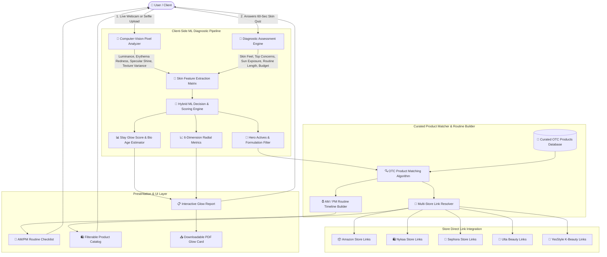
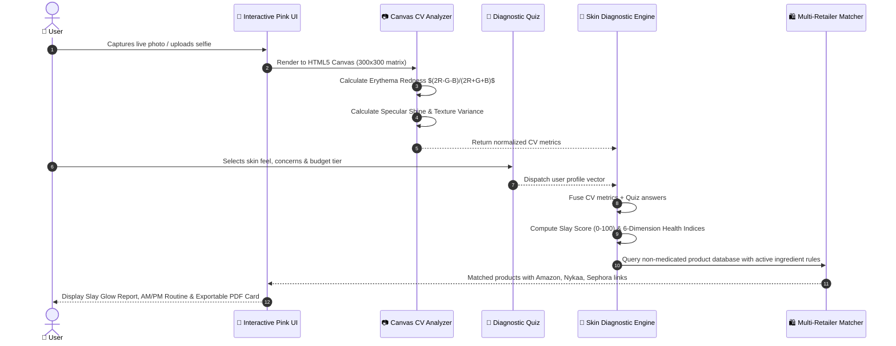

# SlaySkin ✨ AI-Powered Non-Medicated Skincare & Routine Matcher

<div align="center">

[](https://ridhimasharma11404.github.io/SlaySkin-/)
[](https://github.com/RidhimaSharma11404/SlaySkin-)
[](https://opensource.org/licenses/MIT)

**[🌟 Click Here to Visit Live Web App](https://ridhimasharma11404.github.io/SlaySkin-/)**

*Next-Gen AI Skincare Diagnostic & Routine Matcher with Interactive Pink Aesthetic, Computer-Vision ML Face Scanning, Diagnostic Assessment, and Multi-Store Product Reference Links.*

</div>

---

## 🌟 Overview

**SlaySkin** is an over-the-counter, non-medicated skincare diagnostic and routine-matching web platform. Instead of recommending heavy prescription medications, SlaySkin focuses on safe, dermatologist-approved daily essentials (**facewashes, vitamin serums, hydrating barrier creams, broad-spectrum sunscreens, and soothing toners**) with direct clickable reference and purchase links across **Amazon, Nykaa, Sephora, Ulta Beauty, and YesStyle**.

---

## 🏗️ System Architecture & Data Flow

Below is the complete architectural layout of SlaySkin, highlighting how the Computer-Vision pixel extractor, heuristic ML scoring matrix, diagnostic quiz engine, and multi-retailer product catalog interact.



---

## 🔬 Machine Learning & Diagnostic Engine Workflow



---

## ✨ Core Features & Modules

### 1. 💖 Interactive Pink Glassmorphism UI
- Canvas particle engine rendering glowing blush sparkles and floating orbs that react dynamically to mouse movement.
- Modern glassmorphic cards with frosted blur overlays and rose-gold accents.

### 2. 📸 Computer-Vision Skin Scanner
- Real-time webcam capture with glowing oval alignment frame and scanning laser animation.
- Image upload (JPG, PNG, WEBP) & pre-calibrated sample face profiles (Maya, Aria, Chloe).
- Pixel-level texture and color temperature diagnostic extraction.

### 3. 📝 60-Second Diagnostic Skincare Quiz
- 5-step interactive assessment:
  1. Midday skin feel (Oily, Dry, Combination, Sensitive, Normal).
  2. Main concerns (Acne, Hyperpigmentation, Dullness, Large Pores, Dehydration, Redness, Fine Lines).
  3. Daily UV sun exposure levels.
  4. Preferred routine length (Minimalist 2-step, Balanced 4-step, K-Beauty 6-step).
  5. Budget tier and shopping store preference.

### 4. 📊 Comprehensive SlaySkin Glow Report
- **Overall Slay Score (0–100)** with biological skin age comparison.
- **6-Dimension Metric Breakdown**:
  - Hydration & Barrier Moisture Retention
  - Texture Smoothness & Pore Elasticity
  - Sebum & Oil Equilibrium
  - Pore Congestion & Clarity
  - Barrier Defense & Resilience
  - Natural Radiance & Glow Index
- **Hero Active Recommendations** (Niacinamide, Hyaluronic Acid, Centella, Vitamin C, Alpha Arbutin).
- **Ingredients to Limit/Avoid** (Comedogenic oils, high synthetic fragrances).
- **One-Click Downloadable PDF Glow Card** powered by `jsPDF` and `html2canvas`.

### 5. 🛍️ Curated Non-Medicated Product Matcher & Multi-Store Links
- Curated catalog of top-rated OTC skincare essentials across **CeraVe, The Ordinary, Minimalist, COSRX, Beauty of Joseon, Paula's Choice, Neutrogena, Cetaphil**, etc.
- Smart Match % badge + detailed "Why this matches your skin" explanations.
- Direct clickable buy & reference links for:
  - 🛒 **Amazon**
  - 🛍️ **Nykaa**
  - 💄 **Sephora**
  - 🏪 **Ulta Beauty**
  - 🌸 **YesStyle**
  - 🌐 **Brand Official Stores**

### 6. 🧴 Step-by-Step AM / PM Routine Builder
- Separate Morning (AM) and Evening (PM) timeline views.
- Sequential application order with dermatologist tips and interactive completion checklist.

### 7. 🔬 Ingredient Safety & Comedogenic Scanner
- Paste ingredient labels from any bottle to check comedogenic rating (0 to 5), irritation index, and active benefits.

### 8. 👤 User Authentication & Guest Profiles
- Sign In, Sign Up, or Instant 1-Click Guest profile with local storage persistence.

---

## 📂 Project Directory Structure

```
SlaySkin/
├── .github/
│   └── workflows/
│       └── deploy.yml              # Automated GitHub Pages CI/CD Pipeline
├── public/
│   ├── favicon.svg                 # SlaySkin Sparkle Icon
│   └── icons.svg
├── src/
│   ├── assets/                     # Images and brand graphics
│   ├── components/
│   │   ├── AnalysisResults.jsx     # Full Glow Report & PDF Card Generator
│   │   ├── AuthModal.jsx           # Glassmorphic Login / Guest Profile Modal
│   │   ├── Footer.jsx              # Footer with disclaimer & store directory
│   │   ├── HeroSection.jsx         # Pink aesthetic hero with interactive previews
│   │   ├── IngredientChecker.jsx   # Comedogenic & Safety ingredient scanner
│   │   ├── InteractivePinkBg.jsx   # Dynamic canvas particle background
│   │   ├── Navbar.jsx              # Top navigation bar with user profile
│   │   ├── ProductMatcher.jsx      # Multi-store product catalog with search/filter
│   │   ├── RoutineBuilder.jsx      # AM/PM sequential skincare timeline
│   │   ├── SkinQuiz.jsx            # Multi-step diagnostic quiz
│   │   └── SkinScanner.jsx         # Live webcam & upload computer-vision scanner
│   ├── data/
│   │   ├── ingredientsData.js      # Skincare ingredient dictionary & ratings
│   │   ├── products.js             # Curated OTC products database with store links
│   │   └── quizQuestions.js        # Diagnostic questions & scoring weights
│   ├── utils/
│   │   └── skinAnalyzer.js         # Computer-vision & diagnostic fusion ML algorithm
│   ├── App.jsx                     # Root application coordinator
│   ├── index.css                   # Tailwind CSS v4 & custom glassmorphism styles
│   └── main.jsx                    # React entrypoint
├── index.html                      # HTML template with Google Fonts
├── package.json                    # Project dependencies & scripts
├── vite.config.js                  # Vite configuration with Tailwind CSS plugin
└── README.md                       # Comprehensive documentation
```

---

## ⚡ Quick Start / Local Development

### Prerequisites
- Node.js (v18+)
- npm or yarn

### Installation & Run

```bash
# 1. Clone the repository
git clone https://github.com/RidhimaSharma11404/SlaySkin-.git
cd SlaySkin-

# 2. Install dependencies
npm install

# 3. Start development server
npm run dev
```

Open [http://localhost:5173](http://localhost:5173) in your browser.

### Building for Production

```bash
npm run build
```

---

## 🚀 Live Deployment

The live application is hosted on GitHub Pages:
🔗 **[https://ridhimasharma11404.github.io/SlaySkin-/](https://ridhimasharma11404.github.io/SlaySkin-/)**

---

## 🛡️ Medical & Cosmetic Disclaimer

*SlaySkin is an AI-driven over-the-counter skincare reference and cosmetic routine recommendation tool. All matched products are gentle, non-medicated cosmetic essentials. SlaySkin does not provide medical diagnosis or replace consultation with a licensed dermatologist for medical skin conditions.*

---

<div align="center">
  <sub>Built with 💖 for healthy, glowing skin • SlaySkin AI</sub>
</div>
